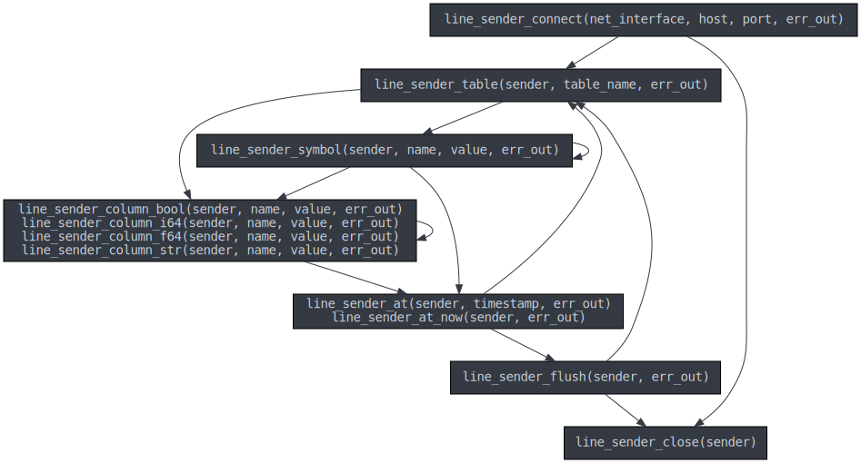
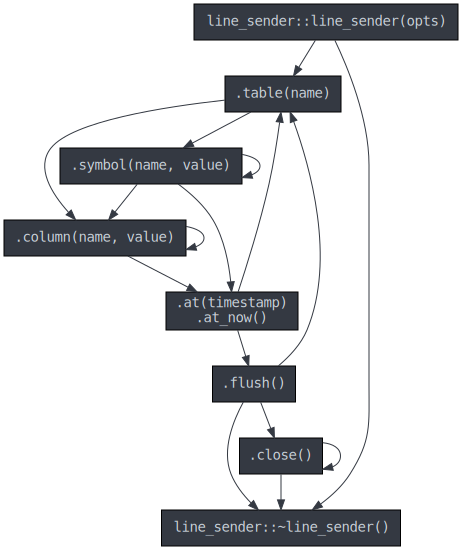

# c-questdb-client
**QuestDB - InfluxDB Line Protocol - Ingestion Client Library for C and C++**

This library makes it easy to insert data into [QuestDB](https://questdb.io/).

* Implementation is in C11, with no dependency on the C++ standard library
  for simpler inclusion into your projects.
* The C++ API is a header-only wrapper written in C++17.

## Community

If you need help, have additional questions or want to provide feedback, you
may find us on [Slack](https://slack.questdb.io).

You can also [sign up to our mailing list](https://questdb.io/community/)
to get notified of new releases.

## Protocol

This client library implements the InfluxDB Line Protocol (ILP) over TCP.

To understand the benefits and limitations of using the protocol, you may want
to consult the
[protocol reference docs](https://questdb.io/docs/reference/api/ilp/overview/).

Whilst this library performs significant input validation upfront,
it can't report errors that happen in the server as the protocol is not designed
to report them.

For example, the client library will report that a supplied string isn't encoded
in UTF-8, but will not report that a column previously used to record a
`BOOLEAN` is later incorrectly used to record a `STRING`.

Unreported errors such as this one usually result in skipped rows that don't
get saved.

Other errors, such as the database running out of disk space or crashing will
result in a TCP connection drop, but also uncertainty from the client's
perspective on which records were written.

With these caveats out of the way, you can however expect well-formed data to be
written so long as it has been received by the database, caveat bugs and system
errors.

The line protocol is currently the fastest way to insert data into
QuestDB, but if the lack of confirmation of written data is a concern to you,
you may want to consider alternatives such as inserting via CSV uploads or
through the PostgreSQL interface. Those alternatives are slower but more robust.
The choice of input mechanism will depend on your use case.

When using the line protocol, data will be written in the order it is
sent, unless you configured the
[out-of-order feature](https://questdb.io/docs/guides/out-of-order-commit-lag/#how-to-configure-out-of-order-ingestion)
in QuestDB which will reorder records based on timestamp for a given insertion
time window.

## Avoiding data input errors and skipped rows

When inserting data through the API, you must follow a set of rules.
Some are validated by the client library, others will cause the engine to fail
silently resulting in rows not getting inserted.

### Library-validated rules

* Strings and symbols must be passed in as valid UTF-8 which
  need not be nul-terminated.
* Table names, symbol and column names can't contain the characters `?`, `.`,
  `,`, `'`, `"`, `\`, `/`, `:`, `(`, `)`, `+`, `-`, `*`, `%`, `~`,
  `' '` (space), `\0` (nul terminator),
  [ZERO WIDTH NO-BREAK SPACE](https://unicode-explorer.com/c/FEFF).
* Each row should contain, *in order*:
  * table name
  * at least one of:
    * symbols, zero or more
    * columns, zero or more
  * timestamp, optionally

### Non-validated rules

The following is a non-exhaustive of guidelines to follow:

* For a given row, a column name should not be repeated.
  If it's repeated, only the first value will be kept.
  This also applies to symbols.
* Values for a given colum should always have the same type.
  If changing types the whole row will be dropped (unless we can cast).
* If supplying timestamps these need to be at least equal to
  previous ones in the same table, unless using the out of order
  feature. Such rows would be dropped.
* The timestamp column should be written out through the provided
  `line_sender_at` function (in C) or or `.at()` method in (C++).
  It is also possible to write out additional timestamps values
  as columns.

*Refer to the
[protocol reference docs](https://questdb.io/docs/reference/api/ilp/overview/)
for details and more usage guidelines.*

### Data type conversions

The ILP protocol has its own set of data types which is smaller
that the set supported by QuestDB.
We map these types into QuestDB types and perform conversions
as necessary wherever possible.

## Building this library

We do not ship binaries. To build, prepare your system with:
  * A C/C++ compiler which supports C11 and C++17.
  * CMake 3.15.0 or greater.

Then follow the [build instructions](BUILD.md). It covers:
  * Compiling on Windows / Linux and MacOS.
  * The build different outputs (dynamic, static, static `-fPIC`).
  * Running unit tests.
  * Running system tests.

## Including `c-questdb-client` into your project

Once you know you can build the library, you can learn how to
[add it as a dependency to your project](DEPENDENCY.md). Here we cover:
  * Github tags and which version of the code you should use.
  * Integrating via CMake `FetchContent`.
  * Integrating via CMake `add_subdirectory`.
  * Notes on keeping code up to date with `git subtree` and `git submodule`.
  * Integrating build systems other than CMake.

## Usage and Examples

### From a C program

```c
#include <questdb/line_sender.h>

...

line_sender_error* err = NULL;
line_sender* sender = line_sender_connect(
  "0.0.0.0",   // bind to all interfaces
  "127.0.0.1", // QuestDB hostname
  "9009",      // QuestDB port
  &err);
```

See a [complete example in C](examples/line_sender_c_example.c).

### From a C++ program

```cpp
#include <questdb/line_sender.hpp>

...

// Automatically connects on object construction.
questdb::line_sender sender{
  "127.0.0.1",  // QuestDB hostname
  "9009"};      // QuestDB port

```

See a [complete example in C++](examples/line_sender_cpp_example.cpp).

### How to use the API
The API is sequentially coupled, meaning that methods need to be called in a
specific order.

For each row you need to specify a table name and at least one symbol or
column. Symbols must be specified before columns.
Once you're done with a row you must add a timestamp calling `at` or `at_now`.

This ordering of operations is documented for both the C and C++ APIs below.

#### C function calling order



Note that this diagram excludes error handling paths: One can call
`line_sender_close(sender)` after any operation.

The `line_sender_close(sender)` function will release memory and therefore
must be called exactly once per created object.

In the C API, functions that can result in errors take a `line_sender_error**`
parameter as last argument. When calling such functions you must check the
return value for errors. Functions that return `bool` use `false` to indicate
a failure.

You may then call `line_sender_error_msg(err)` and
`line_sender_error_get_code(err)` to extract error details.

Once handled, the error object *must* be disposed by calling
`line_sender_error_free(err)`.

On error you must also call `line_sender_close(sender)`.

Here's a complete example on how to handle an error without leaks:

```c
line_sender* sender = ...;
line_sender_error* err = NULL;
if (!line_sender_flush(sender, &err))
{
  size_t msg_len = 0;
  const char* msg = line_sender_error_msg(err, &msg_len);
  fprintf(stderr, "Could not set table name: %.*s", (int)msg_len, msg);

  // Clean-up
  line_sender_error_free(err);
  line_sender_close(sender);
  return;
}
```

This type of error handling can get error-prone and verbose,
so you may want to use a `goto` to simplify handling
(see [example](examples/line_sender_c_example.c)).

#### C++ method calling order



Note how if you're using C++, `.close()` can be called multiple times and will
also be called automatically on object destruction.

For simplicity the the diagram above does not show that the `.close()` method
and the `~line_sender` destructor.

Note that most methods in C++ may throw `questdb::line_sender_error`
exceptions. The C++ `line_sender_error` type inherits from `std::runtime_error`
and you can obtain an error message description by calling `.what()`.

#### Resuming after an error

If you intend to retry, you must create a new sender object: The same sender
object can't be reused.

## Symbols or Strings

SYMBOLs are strings with which are automatically
[interned](https://en.wikipedia.org/wiki/String_interning) by the database on a
per-column basis.
You should use this type if you expect the string to be re-used over and over.
This is common for identifiers, etc.

For one-off strings use STRING columns.

For more details see our
[datatypes](https://questdb.io/docs/reference/sql/datatypes) page.

## If you don't see any data

You may be experiencing one of these three issues.

### QuestDB configuration

If you can't initially see your data through a `select` query straight away,
his is normal: by default the database will only commit data it receives
though the line protocol periodically to maximize throughput.

For dev/testing you may want to tune the following database configuration
parameters as so:

```ini
# server.conf
cairo.max.uncommitted.rows=1
line.tcp.maintenance.job.interval=100
```

The defaults are more applicable for a production environment.

For these and more configuration parameters refer to [database configuration
](https://questdb.io/docs/reference/configuration/)documentation.

### API usage
The API doesn't send any data over the network until the `line_sender_flush`
function (if using the C API) or `.flush()` method (if using the C++ API API)
is called.

*Closing the connection will not auto-flush.*

## License

The code is released under the [Apache License](LICENSE).
