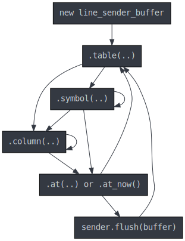

# Getting Started with C++

## Building and depending on this library
* To begin with, we suggest first building the library to ensure you have all
  the tooling and build dependencies set up just right by following the
  [build instructions](BUILD.md)
* Then read the guide for including this library as a
  [dependency from your project](DEPENDENCY.md).

## Complete Examples

* [Basic example in C++](../examples/line_sender_cpp_example.cpp).
* [With authentication](../examples/line_sender_cpp_example_auth.cpp).
* [With authentication and TLS](../examples/line_sender_cpp_example_auth_tls.cpp).
* [Custom certificate authority file](../examples/line_sender_c_example_tls_ca.c).

## API Overview

### Header

* [`.hpp` header file](../include/questdb/ingress/line_sender.hpp)

### Connnecting

```cpp
#include <questdb/ingress/line_sender.hpp>

...

// Automatically connects on object construction.
questdb::ingress::line_sender sender{
    "localhost",  // QuestDB hostname
    9009};        // QuestDB port

```

For more advanced use cases, such as those requiring authentication or
full-connection encryption via TLS, first, create an `opts` object then call its
methods to populate its options and then pass the `opts` object to the
`line_sender` constructor.

### Building Messages

The `line_sender` object is responsible for connecting to the network and
sending data.

Use the `line_sender_buffer` type to construct messages (aka rows, aka records,
aka lines).

To avoid malformed messages, the `line_sender_buffer` object's methods
must be called in a specific order.

For each row, you need to specify a table name and at least one symbol or
column. Symbols must be specified before columns.

You can accumulate multiple lines (rows) with a given buffer and a buffer is
re-usable, but a buffer may only be flushed via the sender after a call to
`buffer.at(..)` (preferred) or `buffer.at_now()`.

```cpp
questdb::ingress::line_sender_buffer buffer;
buffer
    .table("cpp_cars")
    .symbol("id", "d6e5fe92-d19f-482a-a97a-c105f547f721")
    .column("x", 30.5)
    .at(timestamp_nanos::now());

// To insert more records, call `buffer.table(..)...` again.

sender.flush(buffer);
```

Diagram of valid call order of the buffer API.



## Error handling

Note that most methods in C++ may throw `questdb::ingress::line_sender_error`
exceptions. The C++ `line_sender_error` type inherits from `std::runtime_error`
and you can obtain an error message description by calling `.what()` and an
error code calling `.code()`.

## Further Topics

* [Data quality and threading considerations](CONSIDERATIONS.md)
* [Authentication and TLS encryption](SECURITY.md)
